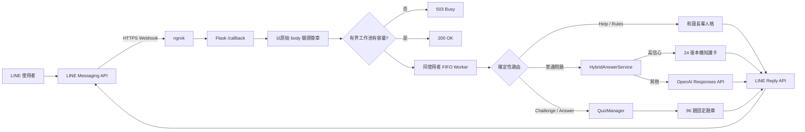

# 「永恆北極星」系統架構

## 1. 目標

系統同時提供：

- 受限來源的跨域科學自由問答。
- 不依賴模型的 Help、Rules、Score、Quit 與五題式星之試煉。
- 快速 Webhook ACK、同對話 FIFO、容量背壓、簽章驗證與有界記憶。

本專題使用既有 OpenAI 模型與 Responses API，沒有自行訓練模型。96 題試煉採固定正解與人工撰寫解說，不由模型臨場生成。

## 2. 資料流



## 3. Webhook 邊界

1. 讀取原始 request body。
2. 使用 `X-Line-Signature` 驗證，失敗回 400。
3. 解析完整事件批次。
4. 有界 dispatcher 原子檢查容量：全批接受或全批拒絕。
5. 接受後立即回 200；容量不足回 503，避免假裝已可靠接收。
6. 背景 worker 依加鹽 hash conversation key 排程；同 key FIFO，不同 key 可並行。

200 ACK 之後的 worker 或 Reply API 失敗不保證 LINE 會重新投遞，因此系統不得把「清除 dedupe」描述成可靠重試機制。Reply API 沒有在本專案可用的安全冪等鍵，網路結果不明時不盲目重試。

## 4. 問答路徑

```text
文字
  ├─ 精確命令 → Help / Quiz / Score / Quit
  ├─ 進行中試煉 → A/B/C/D 或目前題目提醒
  └─ 一般問題
       ├─ 知識卡高信心命中 → 固定事實回答
       └─ 不確定 → 受限模型，只可引用 24 張卡
```

本機 matcher 依序使用 exact、唯一 contained alias 與保守相似度；操作型要求如「幫我寫黑洞遊戲」會被排除，不能因包含科學詞彙就誤命中。

## 5. 試煉狀態

QuizManager 只保存記憶體內的短期場次：

```text
hashed user key
→ session id
→ vault / difficulty
→ 5 unique questions
→ current index / score / streak / best streak
→ touched_at
```

答案 Postback：

```text
ep:a:<session>:<question>:<choice>:<HMAC>:v1
```

HMAC 同時納入加鹽後 user key，因此符文不能跨人使用；session 與 question 綁定防止舊題重播；TTL、場次完成與退出都會使狀態失效。

## 6. 元件責任

| 元件 | 責任 |
|---|---|
| `commands.py` | NFKC 正規化與 exact command aliases |
| `dispatcher.py` | 有界批次入列、同 key FIFO、跨 key 並行 |
| `app.py` | 路由、事件編排、快速 ACK 與錯誤邊界 |
| `persona.py` | 和藹長輩與守門人情境語氣 |
| `quiz.py` | 題庫驗證、場次、HMAC、評分與 TTL |
| `line_gateway.py` | LINE TextMessage、Quick Reply 與單次 Reply API |
| `knowledge.py` | 24 張知識卡與保守本機命中 |
| `answer_service.py` | 本機優先與受限模型 fallback |
| `memory.py` | 有界、短期、加鹽 hash 對話記憶與事件去重 |

## 7. 容量與時間預算

啟動時會以 worker 數、queue 容量、單一 key backlog、OpenAI timeout 與 LINE reply timeout 計算保守的最壞串行服務時間。若超過 55 秒安全預算，設定直接拒絕啟動。

這不是保證 reply token 永遠有效，而是避免使用者把參數調成明顯不可能完成的組合。

## 8. 評估邊界

| 證據 | 能證明 | 不能證明 |
|---|---|---|
| 單元／整合測試 | 狀態機與失敗路徑符合程式規格 | 真實手機網路與 LINE 後台設定正確 |
| 題庫 schema 驗證 | 題數、平衡、來源欄位與格式正確 | 所有題目教育品質已由真人驗證 |
| 離線自由問答資料驗證 | 卡片與評估檔結構正確 | 模型線上正確率 |
| GitHub Actions | 乾淨 Linux 環境可安裝、編譯與測試 | Windows/ngrok/手機 E2E 已通過 |
| 手機 E2E | 實際 LINE 主流程可用 | 長期大量流量可靠性 |

分類 Accuracy、固定試煉得分與回答事實正確率必須分開報告。
