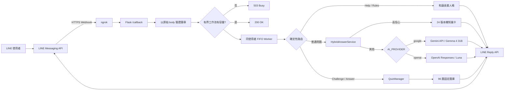

# 「永恆北極星」系統架構

## 1. 目標

系統同時提供：

- 受限來源的跨域科學自由問答。
- 不依賴模型的 Help、Rules、Score、Quit 與五題式星之試煉。
- 快速 Webhook ACK、同對話 FIFO、容量背壓、簽章驗證與有界記憶。
- 可切換 **Google Gemma 4 31B** 或 **OpenAI Luna** 的模型 fallback。

本專題沒有自行訓練模型。96 題試煉採固定正解與人工撰寫解說，不由模型臨場生成。

## 2. AI Provider 策略

`AI_PROVIDER` 支援：

```text
google | openai | auto
```

- `google`：使用 `GEMINI_API_KEY` 與 `GEMINI_MODEL`，預設 `gemma-4-31b-it`。
- `openai`：使用 `OPENAI_API_KEY` 與 `OPENAI_MODEL`，預設 `gpt-5.6-luna`。
- `auto`：有 Google key 時優先 Google，否則使用 OpenAI。

**不做執行時跨供應商 fallback。** 這是刻意的成本防護：Google 免費額度、rate limit 或 API 發生錯誤時，不應自動開始消耗 OpenAI 付費額度。

Google Gemma 4 路徑直接呼叫 Gemini Developer API `generateContent`，使用 `systemInstruction`、JSON-only 輸出提示與 `minimal` thinking，再由程式端嚴格解析 JSON 並執行知識卡語意驗證。Google Structured Outputs 的支援模型清單目前未明列 Gemma 4，因此本專案不把 Gemma 4 的可用性依賴在 response schema 上；只有改用支援該功能的 `gemini-*` 模型時，才會送出 JSON schema。OpenAI 路徑則使用 Responses API structured output。兩邊最後都經過相同的 `KnowledgeBase.validate_answer()` 驗證。

## 3. 資料流



## 4. Webhook 邊界

1. 讀取原始 request body。
2. 使用 `X-Line-Signature` 驗證，失敗回 400。
3. 解析完整事件批次。
4. 有界 dispatcher 原子檢查容量：全批接受或全批拒絕。
5. 接受後立即回 200；容量不足回 503，避免假裝已可靠接收。
6. 背景 worker 依加鹽 hash conversation key 排程；同 key FIFO，不同 key 可並行。

200 ACK 之後的 worker 或 Reply API 失敗不保證 LINE 會重新投遞，因此系統不得把「清除 dedupe」描述成可靠重試機制。Reply API 沒有在本專案可用的安全冪等鍵，網路結果不明時不盲目重試。

## 5. 問答路徑

```text
文字
  ├─ 精確命令 → Help / Quiz / Score / Quit
  ├─ 進行中試煉 → A/B/C/D 或目前題目提醒
  └─ 一般問題
       ├─ 知識卡高信心命中 → 固定事實回答（0 API 成本）
       └─ 不確定
            ├─ Google → Gemma 4 31B
            └─ OpenAI → Luna
```

本機 matcher 依序使用 exact、唯一 contained alias 與保守相似度；操作型要求如「幫我寫黑洞遊戲」會被排除，不能因包含科學詞彙就誤命中。

## 6. 試煉狀態

QuizManager 只保存記憶體內的短期場次：

```text
hashed user key
→ session id
→ vault / difficulty
→ 5 unique questions
→ current index / score / streak / best streak
→ touched_at
```

答案 Postback：

```text
ep:a:<session>:<question>:<choice>:<HMAC>:v1
```

HMAC 同時納入加鹽後 user key，因此符文不能跨人使用；session 與 question 綁定防止舊題重播；TTL、場次完成與退出都會使狀態失效。

## 7. 元件責任

| 元件 | 責任 |
|---|---|
| `commands.py` | NFKC 正規化與 exact command aliases |
| `dispatcher.py` | 有界批次入列、同 key FIFO、跨 key 並行 |
| `app.py` | 路由、事件編排、快速 ACK 與錯誤邊界 |
| `persona.py` | 和藹長輩與守門人情境語氣 |
| `quiz.py` | 題庫驗證、場次、HMAC、評分與 TTL |
| `line_gateway.py` | LINE TextMessage、Quick Reply 與單次 Reply API |
| `knowledge.py` | 24 張知識卡與保守本機命中 |
| `answer_service.py` | 本機優先、Google Gemma / OpenAI Luna 受限 fallback |
| `config.py` | AI provider 選擇、金鑰與延遲預算 |
| `memory.py` | 有界、短期、加鹽 hash 對話記憶與事件去重 |

## 8. CI 與發布認證

Actions 只保留兩條永久工作流：

- `Main CI`：安裝鎖定環境、依賴完整性、compile、完整測試、branch coverage 與離線評估資料驗證。
- `Release certification`：只在 Main CI 成功後，唯讀 checkout **剛通過測試的精確 SHA**，再次驗證 96 題／16 主題／答案位置平衡、AI provider 契約與工作流清潔度。

發布認證只有 `contents: read` 權限，不會自己 commit、push main 或移動 tag。裁判不修改被裁判的版本。

## 9. 容量與時間預算

啟動時會以 worker 數、queue 容量、單一 key backlog、模型 timeout 與 LINE reply timeout 計算保守的最壞串行服務時間。若超過 55 秒安全預算，設定直接拒絕啟動。

這不是保證 reply token 永遠有效，而是避免使用者把參數調成明顯不可能完成的組合。

## 10. 隱私邊界

Google Gemini Developer API Free Tier 目前允許 Google 使用內容改善產品，因此：

- 不應送入密碼、API key、私人醫療資料、身份證號或其他敏感個資。
- 本專案本身仍不把使用者問題全文寫入日誌。
- 若未來部署為正式服務，應重新評估 Free Tier 資料使用條款或改用不使用內容改善產品的方案。

OpenAI 與 Google 的服務條款、資料使用政策、免費額度與價格都可能改變；專題報告應記錄測試日期與實際 provider。
