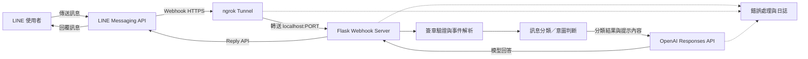

# 「永恆北極星」系統架構

> 文件狀態：骨架版，待依實際程式路由、環境變數與部署方式補充。

## 1. 技術流

核心資料流：**LINE → ngrok → Flask → OpenAI Responses API → Flask → LINE**。

本系統使用既有的 OpenAI 模型與 Responses API，**未自行訓練模型**。訊息分類評估與回答事實正確率是兩組不同的評估面向，需分開設計資料、指標與結果解讀。

## 2. Mermaid 架構圖

## 3. 元件責任

| 元件 | 責任 | 輸入 | 輸出 |
|---|---|---|---|
| LINE 使用者 | 發送問題並查看回答 | 文字訊息 | 回覆訊息 |
| LINE Messaging API | 傳遞事件與回覆訊息 | Webhook、Reply API 請求 | 事件 payload、訊息顯示 |
| ngrok | 將本機服務暫時公開並轉送 HTTPS 請求 | 公開請求 | Flask 本機請求 |
| Flask | 提供 Webhook 路由、驗證、編排與錯誤處理 | LINE event | API 請求、LINE 回覆 |
| 訊息分類／意圖判斷 | 判斷訊息類別或處理路徑 | 使用者文字 | 類別、信心或路由資訊 |
| OpenAI Responses API | 根據提示產生模型回答 | 分類結果、上下文、使用者問題 | 回答文字 |
| 日誌與錯誤處理 | 協助追蹤失敗與診斷問題 | 各層事件 | 安全且可追蹤的紀錄 |

## 4. 主要流程骨架

1. 使用者在 LINE 傳送文字訊息。
2. LINE Messaging API 將 Webhook 事件送至 ngrok 公開網址。
3. ngrok 將請求轉送至本機 Flask 服務。
4. Flask 驗證請求、解析事件並取得訊息內容。
5. 系統執行訊息分類或意圖判斷。
6. Flask 呼叫 OpenAI Responses API 產生回答。
7. Flask 透過 LINE Reply API 回傳回答。
8. 系統記錄必要的處理結果與錯誤資訊，避免記錄密鑰或不必要個資。

## 5. 評估邊界

### 5.1 分類指標

- 評估對象：訊息分類／意圖判斷結果。
- 待補指標：Accuracy、Precision、Recall、F1-score、混淆矩陣。
- 待補資料：標註規則、類別數、樣本數、資料切分方式。

### 5.2 回答事實正確率

- 評估對象：模型回答中的事實是否符合標準答案或可查證來源。
- 待補指標：事實正確率、無法判定比例、錯誤類型分布。
- 待補資料：問題集、標準答案/來源、評審規則與審核者。

> 分類指標反映「分到哪一類」，回答事實正確率反映「回答內容是否正確」；兩者不可互相替代，也不應在報告中混成單一總分。

## 6. 設定與安全待補項目

- [ ] Flask 監聽 Host/Port：`__________`。
- [ ] ngrok 啟動方式與公開網址更新流程：`__________`。
- [ ] LINE Channel Secret／Access Token 的安全保存方式：`__________`。
- [ ] OpenAI API 金鑰的安全保存方式：`__________`。
- [ ] 模型名稱、逾時與重試設定：`__________`。
- [ ] 日誌遮罩、資料保存期限與刪除方式：`__________`。
- [ ] 正式環境 HTTPS、反向代理與可觀測性規劃：`__________`。

## 7. 失敗邊界與排查入口

| 現象 | 優先檢查位置 | 對應文件 |
|---|---|---|
| ngrok `Connection refused` | Flask 是否啟動、Host/Port 是否一致、ngrok 目標是否正確 | `docs/demo-checklist.md` |
| LINE Webhook 驗證失敗 | 公開 URL、路徑、簽章驗證、HTTP 狀態碼 | `docs/demo-checklist.md` |
| 模型呼叫失敗 | API 金鑰、模型設定、配額、逾時與錯誤日誌 | `docs/demo-checklist.md` |
| 回覆內容不正確 | 提示內容、分類路由、標準答案與事實審核流程 | `docs/report-outline.md` |
