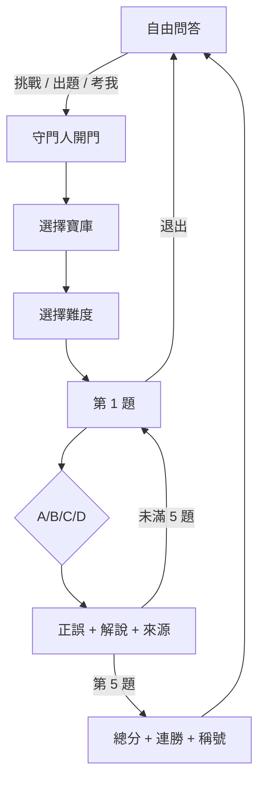

# 星之試煉：題庫與人格設計

## 1. 產品定位

「永恆北極星」不是把自由問答改成補習班題庫，而是在原本的科學問答之外增加一條可重複遊玩的學習路徑：

```text
平常：和藹長輩 → 回答與解惑
挑戰：寶庫守門人 → 出題、判定、教學與結算
```

兩種語氣屬於同一人格。守門人並不羞辱答錯者；威嚴來自規則、儀式與知識標準，而不是刻薄。

這套設計採用 SheepStory 的幾個核心原則：

- 人格是可預測的行為規則，不是形容詞堆或固定口頭禪。
- 特質依情境啟動；長輩在試煉時變得莊重，但價值觀與記憶不重置。
- Greeting 必須同時示範聲音、功能與下一步互動。
- 使用者可以拒絕、退出或重新開始；角色不替使用者決定感受與行動。

## 2. 互動流程



Help、Challenge、Rules、Score、Quit 都由確定性程式路由，不交給模型判斷。試煉進行時，其他自由文字會收到當前題目提醒，避免狀態被普通問答打斷。

## 3. 題庫範圍

目前題庫共300題、24個主題、四座正式寶庫。原始96題／16主題完整保留；第一輪加入科學史、趣味科普、太陽系驚奇與電影科學，第二輪再加入「行星與衛星深度探索」、「宇宙地址與星際航行」、「小天體與行星防禦」及「科幻電影科學實驗室」：

| 寶庫 | 主題 | 題數 |
|---|---|---:|
| 🌌 星海之庫 | 原始天文主題＋科學史／趣味／太陽系／小天體擴充 | 161 |
| 🌍 地脈與生命之庫 | 原始地球生命主題＋趣味擴充 | 37 |
| ⚛️ 萬象法則之庫 | 原始物理化學主題＋趣味擴充 | 30 |
| 🚀 未來幻夢之庫 | 原始工程科幻主題＋趣味／電影擴充 | 72 |

另有「群星寶庫」，從全體題目抽題。

原始 16 個主題各有 6 題：見習 2、遠征 2、守門人 2；原始 96 題仍保留。載入時會在各寶庫／難度組內重新排列選項，使A／B／C／D正解位置差不超過1。30題自由問答評估集是另一份資料，不從300題試煉題庫抽樣。

## 4. 題目品質準則

每題都必須同時滿足：

1. **重要性**：測一個值得帶走的自然模型，而非拼字、年份或人物綽號。
2. **單一最佳答案**：在題幹給定條件下只有一個選項最正確。
3. **可信干擾項**：錯誤選項來自常見誤解或鄰近概念，不用荒謬答案送分。
4. **語法平衡**：正解不應總是最長、最精確或唯一使用專有名詞的選項。
5. **教學解說**：公布答案後說明「為什麼」，必要時也指出常見誤解。
6. **來源可追溯**：使用 NASA、USGS、NOAA、NIH、NIST、DOE、CERN、LIGO、ACS 或原始論文等正式來源。
7. **時間穩定**：避免把短期新聞、當年度排名或尚未複核的新發現寫成固定題。

## 5. 難度定義

### 見習

辨認基礎機制，重點是拆除常見迷思。例如：四季並非由日地距離主導。

### 遠征

需要串聯兩個概念或理解因果鏈。例如：隱沒板塊釋水如何促進上覆地函熔融。

### 守門人

要求分清適用條件、觀測限制或理論邊界。例如：量子電腦只有問題特定的加速，不是所有計算都瞬間完成。

### 命運混合

從同一寶庫的三種難度混抽；「群星寶庫＋命運混合」則跨四大領域混抽。

## 6. 安全與完整性

答案按鈕不直接攜帶「正確／錯誤」旗標，而是包含：

```text
場次 ID + 題目 ID + 選項 + HMAC 簽章 + 版本
```

簽章輸入同時綁定加鹽後的使用者索引。因此：

- 不能把 Alice 的答案符文拿給 Bob 使用。
- 不能把 A 改成 B 後繼續通過驗證。
- 不能在下一題重播上一題按鈕。
- 場次逾時或結束後，舊符文失效。

原始 LINE ID 不作為字典 key 或日誌欄位。

## 7. 不採用的方案

- **AI 臨場生成正解與選項**：答案可能漂移，且難以事前驗收。
- **把所有輸入都送模型判斷**：Help 與 Quiz 可能被誤路由，也浪費費用。
- **永久排行榜與帳號資料庫**：超出單人課堂專題的必要範圍，增加隱私與維運成本。
- **立即加入 Rich Menu、RPG 裝備與每日登入**：展示增益不如狀態複雜度增長，先拒絕範圍蔓延。

## 8. 後續擴充邊界

在300題內容契約與核心互動穩定前，不新增會分散注意力的遊戲系統。後續若繼續擴充，先補科學內容與來源，再評估新的互動機制：

1. 題目答對率與錯誤選項分布的匿名統計。
2. 依實際難度重新校準題目。
3. 錯題複習模式。
4. Rich Menu 或 Flex Message 視覺化。

沒有作答資料前就加自適應難度，只是把猜測包裝成演算法。
